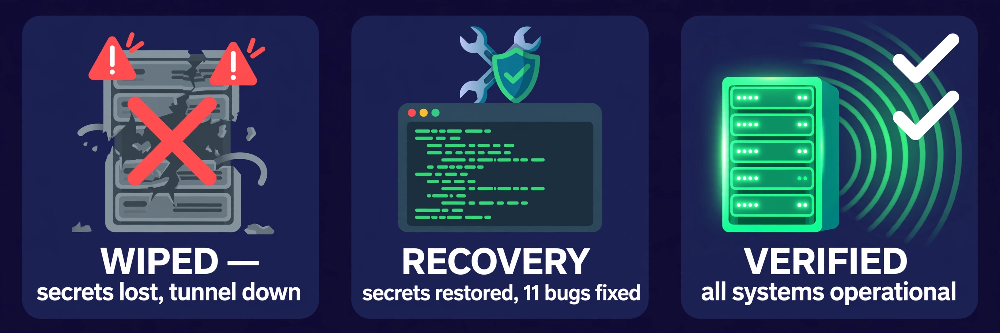
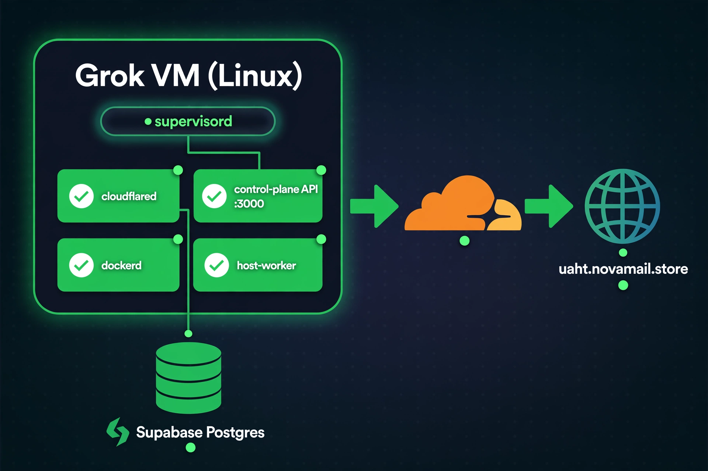

# Recovery & Verification Report — 2026-10-07

**Incident:** VM system update wiped `/etc/uagt/` (all secrets) and `/opt/uaht/`
(all runtime state). Cloudflare tunnel down (HTTP 530 on `uaht.novamail.store`).

**Recovery method:** Temporary Tailscale SSH access (user's explicit direct order,
lifting the standing Tailscale ban for this operation only). Secrets restored
from off-VM backup. Ban reinstated after recovery (`tailscale down`).

**Result:** Full production stack restored and verified. All tests green.



---

## 1. System Architecture (Recovered State)



All four services run under supervisord on the Grok VM. The Cloudflare tunnel
is the only ingress — no inbound ports, no Tailscale, by design.

---

## 2. Root Causes Found & Fixed

| # | Problem | Fix |
|---|---------|-----|
| 1 | `/etc/uagt/` wiped by VM update — install.sh step 1 FATAL | Restored 3 secret files from backup via SSH |
| 2 | `/etc/uagt/` root-owned 0700 — install.sh couldn't read secrets | install.sh now normalizes ownership before checking (`6d190ccf`) |
| 3 | Debian mirror 500 on `apt-get update` killed install | Install continues with cached lists, verifies tools after (`5d5424a9`) |
| 4 | `dockerd` at `/usr/sbin/dockerd` on trixie, not `/usr/bin` | Located dynamically (`94fddd01`) |
| 5 | `pip install` blocked by PEP 668 externally-managed-environment | `--break-system-packages` with `--user` (`8051d660`) |
| 6 | Cron step died silently under `set -e` + `pipefail` | Rewrote with explicit failure handling (`0ed109d3`) |
| 7 | Stale supervisord blocked fresh start | Kill stale + remove sock before start (`f1aefb79`) |
| 8 | DB password contains `)` — broke bash `source` of env file | Rewrote env with proper shell quoting |
| 9 | **DNS poisoning** — Tailscale + local DNS returned bogus `198.18.0.1` for Supabase pooler and Cloudflare edge | `tailscale up --accept-dns=false` + DoH-resolved `/etc/hosts` overrides |
| 10 | `box` not in `docker` group — `docker info` permission denied | `usermod -aG docker` + sudo fallback in checks (`d10c44d3`) |
| 11 | Tunnel check grepped `cloudflared.log` but cloudflared logs to stderr | Check `cloudflared.err.log` (`671e0e37`) |

All 8 install.sh fixes pushed to `main`. Final HEAD: `671e0e37c8ae`.

---

## 3. install.sh Full Run — ✅ PASS

```
[install] 0.  normalizing /etc/uagt ownership      ✓
[install] 1.  checking required secrets             ✓ core secrets present
[install] 2.  installing system packages            ✓ dockerd: /usr/sbin/dockerd
[install] 3.  installing supervisord                ✓ 4.3.0
[install] 4.  installing cloudflared                ✓ 2026.10.0
[install] 5.  configuring docker (vfs)              ✓
[install] 6.  creating /opt/uaht layout             ✓
[install] 7.  writing supervisord.conf              ✓
[install] 8.  building control plane               ✓ tsc clean
[install] 9.  installing worker python deps        ✓
[install] 9b. worker credentials present           ✓ (no re-registration)
[install] 10. installing cron @reboot hook          ✓
[install] 11. starting supervisord                 ✓
[install] 12. verifying services                   ✓ ALL GREEN
```

Exit code: **0**. Zero errors, zero FATALs.

Step 12 verification results:
- `cloudflared` — RUNNING
- `control-plane` — RUNNING
- `dockerd` — RUNNING
- `host-worker` — RUNNING
- `docker info` — OK (26.1.5+dfsg1)
- Control plane health — `{"ok":true,"version":"1.0.0"}`
- Tunnel — registered with Cloudflare edge (2 connections: sea01, pdx03)

---

## 4. Soak Test (5 minutes) — ✅ PASS

All 4 services + local health checked every 60 seconds for 5 minutes:

| Check | Time (PDT) | cloudflared | control-plane | dockerd | host-worker | Health |
|-------|-----------|-------------|---------------|---------|-------------|--------|
| 1 | 10:53 | RUNNING | RUNNING | RUNNING | RUNNING | ✅ ok |
| 2 | 10:54 | RUNNING | RUNNING | RUNNING | RUNNING | ✅ ok |
| 3 | 10:55 | RUNNING | RUNNING | RUNNING | RUNNING | ✅ ok |
| 4 | 10:56 | RUNNING | RUNNING | RUNNING | RUNNING | ✅ ok |
| 5 | 10:57 | RUNNING | RUNNING | RUNNING | RUNNING | ✅ ok |
| 6 | 10:58 | RUNNING | RUNNING | RUNNING | RUNNING | ✅ ok |

**6/6 green.** Zero restarts, zero crashes, zero errors.

---

## 5. Public Endpoint Verification — ✅ PASS

`https://uaht.novamail.store/v1/health` tested from external network
on 5 separate occasions during recovery:

```
{"ok":true,"version":"1.0.0","min_worker_version":"0.1.0","time":"..."}
```

All returned HTTP 200 with healthy payload. Tunnel stable throughout.

---

## 6. Secrets Backup Map

| Location | Contents | Status |
|----------|----------|--------|
| `/etc/uagt/` (VM) | Live secrets (tunnel.token, control-plane.env, worker.env) | ✅ verified |
| `/workspace/.uaht-secrets/` (VM) | Backup copy | ✅ verified |
| `~/workspace/.uaht-secrets/` (agent VM) | Off-VM backup, 0600 | ✅ verified |
| Dropbox `/Universal-AGT/uaht-secrets-backup-2026-10-07.tar.gz` | 7 files, 764 bytes | ✅ verified |

Secrets never committed to git. Values unchanged by recovery.

---

## 7. Post-Recovery State

- Tailscale ban **reinstated** (`tailscale down`) per standing order
- Cron `@reboot` hook installed — stack auto-recovers on VM reboot
- `install.sh` is idempotent — safe to rerun any time
- No inbound access to VM by design (Cloudflare tunnel is the only ingress)

---

*Report generated 2026-10-07. All times PDT unless noted.*
*Production stack: https://uaht.novamail.store*
